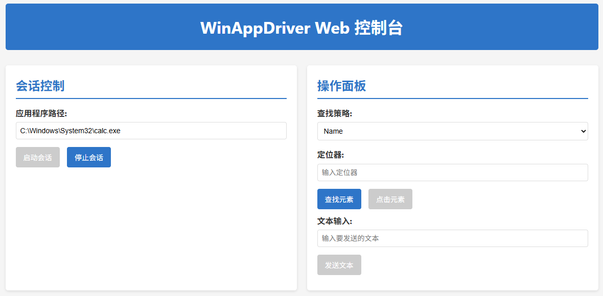
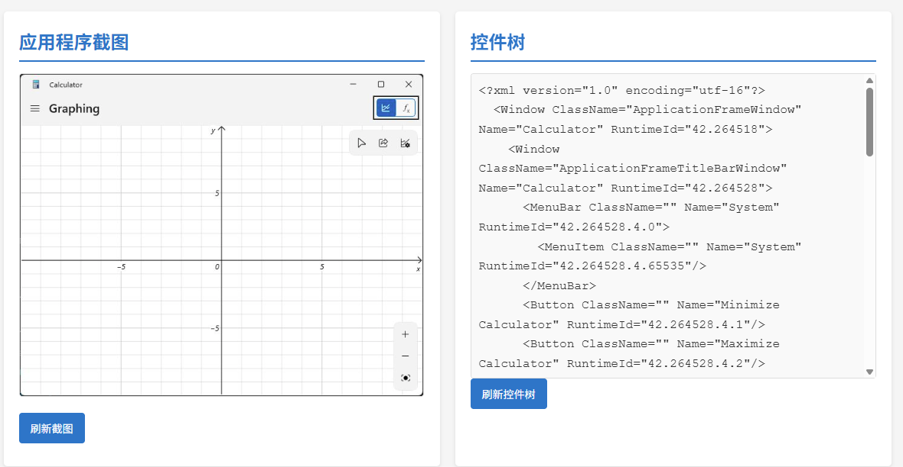
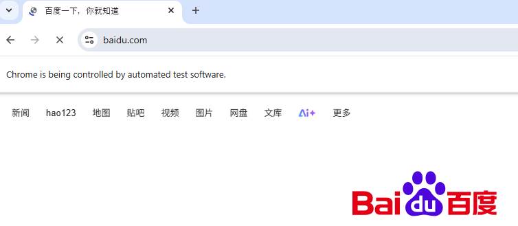

## 关键配置说明：
venv/ 和 .venv/：永远不要把虚拟环境里的数千个第三方包上传。他人应该通过你的 requirements.txt 或 pyproject.toml 来重新构建环境。

__pycache__/：这是 Python 运行产生的字节码，与具体的机器环境有关，不应上传。

.env：用于存放 API 密钥或数据库密码。务必将其排除，以防源码泄露导致安全事故。

.vscode/ 或 .idea/：如果你是个人开发，可以保留；如果是团队协作，建议忽略，因为每个人的编辑器配置可能不同。

## winappdriver-web
给winappdriver套了一个壳子，效果如下图。

## WebScraper-python-selenium
用于自动化抓取网页信息，使用了谷歌的网页驱动。效果如下图。

